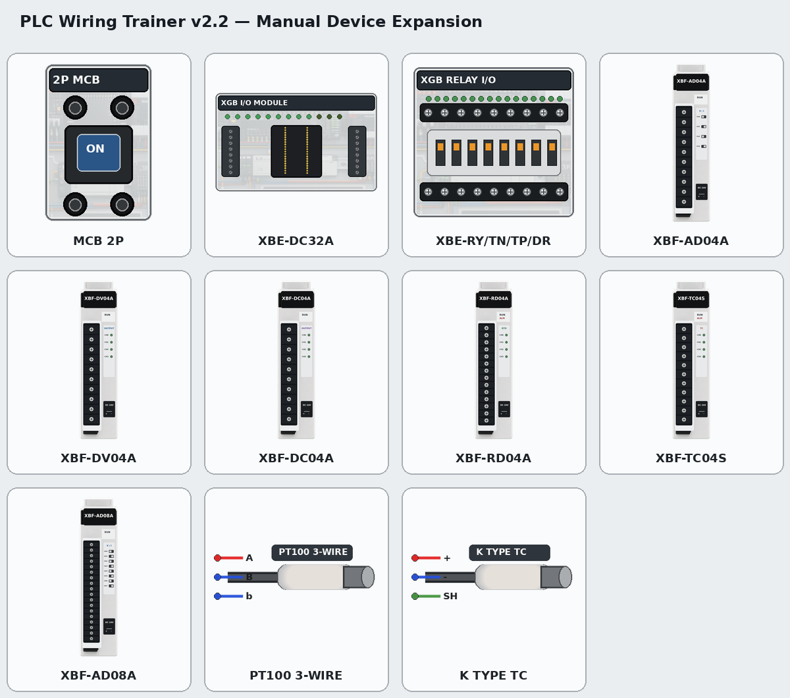

# 박승권의 결선 작업장 v2.7

PLC/HMI/인버터 결선과 서보·MPS·공압 자동화를 연습할 수 있는 데스크톱 도구.

## v2.7 자동화 제어 실습실

상단 `🏭 자동화 실습실` 안에 기존 3축 팔레타이징, 2축 서보, MPS,
공압 제어 실습을 한 화면의 탭으로 통합했습니다.

- 2축 서보: 원점복귀, JOG, ABS/INC, 포인트 테이블, 직선 보간, 리미트·알람
- MPS: 원본 `O0~O17` 출력과 `I0~I26` 입력에 맞춘 공급·드릴·분배·배출·
  리프트·언로딩·컨베이어 물리 플랜트
- 공압: 서비스 유닛, 분배기, 5/2 단·복솔 밸브, 복동 실린더, 유량·누설·진공
- SoV 편집: 제어·이동·장비 삭제·전기 결선·공압 튜브·선 삭제 모드와 3D 연결 저장
- LS 프로필: `XBC-DR32H + XBF-PD02A + L7S/XML` 교육 조합
- Mitsubishi 프로필: `Q03UDVCPU + Q61P + QD75D2N + MR-J4/HG-KR` 교육 조합
- 두 제조사 주소는 앱 내부 교육용 메모리이며 실제 PLC 통신을 수행하지 않음
- 프로젝트 JSON 스키마 9에서 세 실습실의 설정·결과를 저장하고, 복원 시 안전 정지
- 사용자가 수정·재사용 권한을 확인한 로컬 SoV-KDP 빌드에서 장비 외형만 선별 변환
- 2축 서보는 `servo2-workshop.glb`, MPS는 `mps-complete-station.glb` 전체 원본
  장비 어셈블리를 주 화면으로 사용
- 공압은 원본 서비스 유닛·분배기·밸브·속도조절기·실린더 프리팹만 조합하고,
  강의실·의자·벽·테이블 같은 배경 소품은 제외
- 장비 전용 13개 GLB(합계 17.45 MiB), 원본 오브젝트 ID·SHA-256 manifest 포함.
  텍스처는 GLB 안에 최대 2048px WebP로 내장하고 중복 외부 PNG는 두지 않음
- 축 이동·센서·액추에이터·공압 계산과 안전 인터록은 Electron용 독립 런타임으로 구현
- 장면이 정지하면 렌더 루프도 멈추며, Three.js 엔진은 앱의 단일 인스턴스를 공유
- 실행 파일, DLL, 로그인/인증/동글, 네트워크·PLC 프로토콜 코드는 이식하지 않음

구현과 범위: [docs/v2.7-automation-labs.md](docs/v2.7-automation-labs.md)
자산 이식 기록: [assets/imported/sov-kdp/ASSET-NOTICE.md](assets/imported/sov-kdp/ASSET-NOTICE.md)

## v2.6 3축 팔레타이징 디지털 트윈

Electron 작업대의 `🦾 3D 실습` 보기에서 X/Y/Z 리니어 축, 서보 ON, 원점복귀, 조그, 가감속 위치결정, 정·역 리미트, 그리퍼와 다단 팔레트 패턴을 연습할 수 있습니다. `M100`/`D100` 형식의 XG5000 스타일 주소 이미지는 앱 내부 메모리만 구동하며 실제 PLC에는 값을 쓰지 않습니다.

- 3축 자동 사이클: 픽업 → 안전 높이 → 팔레트 격자 적재
- 행·열·단 패턴 설정과 프로젝트 JSON 저장/복원
- 오프라인 Three.js 3D 엔진 포함(CDN/외부 로그인 불필요)
- 3축 동작 로직은 외부 코드에 의존하지 않는 독립 구현
- 구현·주소표: [docs/v2.6-3d-palletizer.md](docs/v2.6-3d-palletizer.md)


## v2.5 실물 · 종이 결선도 · 시퀀스 통합

같은 장비와 같은 `S.wires` Netlist를 **실물 제어반 / 종이 결선도 / 시퀀스 / PLC I/O 표**에서 함께 사용합니다. 종이 결선도나 시퀀스 화면에서 실제 단자를 클릭해 선을 만들거나 삭제하면 제어반 화면에도 동일하게 반영됩니다.

- 업데이트 안내: [UPDATE-v2.5.md](UPDATE-v2.5.md)
- 구현 기록: [docs/v2.5-three-view-netlist.md](docs/v2.5-three-view-netlist.md)
- 예제: `examples/v25-self-hold-three-view.json`

## v2.4 모듈형 장비팩·랙/슬롯·아날로그·Modbus RTU

- `src/device-packs/` 기반 외부 장비팩 등록 구조 도입
- XBC-DR32H CPU와 XBE/XBF/XBL 증설 모듈의 랙·슬롯 자동 배정
- XG5000 P영역 미리보기 주소와 슬롯/통신/고속 모듈 용량 검사
- 신규 `XBL-C41A`, `XBF-PD02A`, V/I 신호 발생기, 4~20mA 압력 트랜스미터
- 실제 전압·전류·RAW·공학값 변환 및 범위/단선/전원 상태 검사
- XBL-C41A 2선식 브리지, Modbus 마스터·국번·통신 형식 검증
- XY-MD02 온도·습도 입력 레지스터 시뮬레이션
- iG5A 주파수 가속·감속, rpm·전류 상태 계산
- 랙 CPU/슬롯, 아날로그, PT100·열전대, Modbus, iG5A를 한 화면에서 편집하는 통합 장비 설정 창
- 신규 미션 `g21`~`g23`, 프로젝트 스키마 6
- 기존 회귀 테스트와 전체 앱 초기화 스모크를 포함해 자동 테스트 61개

상세 구현과 한계: [v2.4 모듈형 장비팩·랙·아날로그·Modbus 기록](docs/v2.4-modular-rack-analog-modbus.md)

업데이트 적용: [v2.3 → v2.4 덮어쓰기 안내](UPDATE-v2.4.md)


## v2.3 역할 기반 제어회로·보호계전 개선

- 같은 타입 장비를 `role`로 구분: 정회전/역회전 MC, 운전/정지 PB, 역할별 표시등을 서로 다른 인스턴스로 배치·자동결선
- `g4` iG5A 정·역운전, `g7` 자기유지, `g9` 정·역 MC 인터록 회로를 실제 접점 흐름에 맞게 재구성
- MDR를 사용하는 미션에 공통 AC L/N 인입을 자동 추가하고, XBC 사용 미션에는 본체 `L/N` 전원도 포함
- 도어→PLC 직접 결선은 일반 미션에서 품질 경고, `g-field`/`g13` 단자대 필수 미션에서는 기능 오류로 구분
- EOCR-3DE/FDE 매뉴얼 기반 `A1/A2`, `95-96`, `97-98`, `07-08`, R/S/T CT 관통 동작 구현
- 신규 `g20` EOCR 과부하 보호 DOL 모터 기동 미션 추가
- 시뮬레이션: MC 자기유지, 정역 동시여자 차단, iG5A 정/역방향, 모터 운전 상태, EOCR TRIP/RESET 지원
- 프로젝트 스키마 5, 미션 스키마 2로 갱신
- Electron preload·sandbox·팝업/외부 이동 차단·CSP 적용
- 회로 런타임과 전체 미션 토폴로지를 포함한 자동 테스트 40개

상세 변경 내역: [v2.3 역할 기반 미션·제어회로 개선 기록](docs/v2.3-role-mission-and-control-circuit-improvements.md)


## v2.2 매뉴얼 장비 확장 및 전기 시뮬레이션 개선

- LS XGB 디지털 증설: `XBE-DC32A`, `XBE-RY16A`, `XBE-TN16A`, `XBE-TP16A`, `XBE-DR16A`
- LS XGB 아날로그/온도: `XBF-AD04A`, `XBF-DV04A`, `XBF-DC04A`, `XBF-RD04A`, `XBF-TC04S`, `XBF-AD08A`
- 현장 센서: `PT100-3W`, `TC-K`, 정식 명칭 `XY-MD02`
- 단상 SMPS 회로용 `MCCB 2P (L/N)` 공개 및 미션 결선 교정
- MDR/PSU는 AC L/N이 실제로 공급될 때만 DC 24V 출력 활성
- 시뮬레이션 중 차단기·퓨즈 클릭으로 개방/투입, PLC 출력 단자 클릭으로 강제 ON/OFF
- 입력 COM, 출력 COM, 모듈 외부전원, RS-485 두 가닥, 아날로그 +/- 및 RTD A/B/b 누락 검사
- RS-485 `A/+`와 `B/-` 극성을 별도 타입으로 검사
- 예전 `MY-MD02` 저장본과 아날로그 전원 단자 `P24/P0V`를 자동 마이그레이션
- 신규 장비 외형은 GPT 생성 이미지를 사용하고, 실제 단자 표기는 코드 오버레이로 렌더링



자세한 구현 근거와 단자표는 [매뉴얼 장비 확장 기록](docs/manual-device-expansion-2026-08.md)을 참고하세요.

## v2.1 제어반 고도화

- **제어반 모드** — DIN 레일 3단 + 배선덕트 + 우측 도어 조작판
- **레일 스냅 배치** — 전원/PLC/단자대/도어 장착 규칙
- **생성형 단자대** — 8P/20P/30P, PE/N/+24V/0V 분배 단자
- **배전 모드** — AC-L / AC-N / +24V / 0V / PE 버스 클릭 결선
- **점퍼 자동** — 단자대 브릿지 + net union
- **덕트 라우팅** — 제어반 모드에서 배선덕트 중심선 경로
- **미션 추가** — g12 배전, g13 도어 경유, g14 제어반 배치

## 빠르게 쓰기 (브라우저)

`index.html` 더블클릭. 끝.

또는 Python만 있으면 로컬 서버로 실행:

```cmd
cd C:\Users\bark\Desktop\내프로그램\plc-wiring-trainer
python -m http.server 18765 --bind 127.0.0.1
```

브라우저에서 `http://127.0.0.1:18765/index.html` 열기.

## 데스크톱 앱으로 만들기 (Electron)

### 1회만 — 의존성 설치

```cmd
cd C:\Users\bark\Desktop\plc-wiring-trainer
npm install
```

(npm이 없다면 https://nodejs.org/ 에서 LTS 설치 후 위 명령)

### 그냥 실행

```cmd
npm start
```

전용 창으로 띄워줌. 메뉴/단축키/전체화면 다 지원.

### 단일 EXE로 빌드 (포터블)

```cmd
npm run build
```

`dist/결선작업장-2.7.0-portable.exe` 생성. USB에 넣고 어디서든 실행 가능.

### 설치형 EXE로 빌드

```cmd
npm run build:installer
```

`dist/결선작업장 Setup 2.7.0.exe` 생성.

## 단축키

| 키 | 동작 |
|----|------|
| `V` | 선택 모드 |
| `W` | 결선 모드 |
| `Space` | 화면 이동 |
| `F` | 화면 맞춤 |
| `+` `-` | 줌 인/아웃 |
| `0` | 100% 줌 |
| `L` `R` | 좌/우 패널 토글 |
| `S` | 시뮬레이션 ON/OFF |
| `/` | 부품 검색 |
| `Del` | 선택 항목 삭제 |
| `Esc` | 취소 |
| `Ctrl+Z` | 실행 취소 |

## 기능

- **부품 라이브러리** — XBC-DR32H, XBF-PD02A, LS L7S/XML, Mitsubishi Q/QD75/MR-J4/HG-KR, XBE/XBF 증설, EXP2-700, XY-MD02, 인버터, 센서·공압·단자대 등
- **제어반 레이아웃** — `📦 제어반` / `🆓 자유` / `🔌 배전` 모드, `🏗 기본제어반` 템플릿
- **자동 라우팅** — 부품 박스 회피 직각선 + 제어반 모드 배선덕트 경로
- **와이어 핸들 드래그** — 와이어 클릭 후 흰 점을 드래그해 경로 조정
- **부품 색상 변경** — 우클릭 메뉴 (푸시버튼 색깔 변경 등)
- **시뮬레이션 모드** — PB·차단기·퓨즈 조작, PLC 출력 강제, 유효 전원 경로, 디지털 I/O, RS-485 준비 상태, 아날로그·RTD·열전대 채널 준비 상태 표시
- **GOAL 미션** — 번호 미션 23개 + 현장 표준 미션. 아날로그 루프, PT100, 열전대, 실제 HMI·MD02 전원/통신, XGB 증설 I/O 점검 포함
- **TIP 시스템** — 각 미션에 학습 포인트, 결선 오류 자동 진단
- **자동 결선** — 미션의 미완료 항목을 정답대로 자동 연결
- **검증** — AC/DC 단락, 전원쌍·I/O COM·RS-485·아날로그 극성·RTD 3선 누락, 레일 배치와 도어 경유 규칙. danger/function 오류가 남으면 미션 클리어 차단
- **저장/불러오기** — localStorage + JSON (`cabinet/rails/ducts/doorPanel/jumpers/boardMode` 포함)
- **PNG 내보내기** — 결선도를 이미지로
- **부품 검색** — 좌측 팔레트 검색창 / 우측 상단 🔍 버튼
- **오프라인 실행** — RBush CDN 의존성을 제거하고 내장 공간 인덱스 fallback 사용
- **자동 테스트** — 전원·통신·온도 채널·자기유지·정역 인터록·EOCR 트립·랙·아날로그·Modbus·3축/2축·MPS·공압·저장·자산을 검증

## 다음 업데이트 후보

- 실제 PLC와 연결하는 선택형·읽기전용 진단 어댑터
- XG-SIM P00/P20 Bridge와 XP-Builder 공동 주소 연동
- 실제 Modbus RTU 프레임·CRC·응답 지연 모델
- 회로 템플릿 라이브러리와 매뉴얼 핀맵 장비팩 확장
