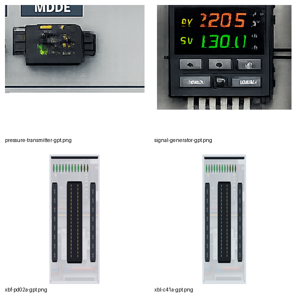

# v2.4 모듈형 장비팩·랙/슬롯·아날로그·Modbus RTU 개선 기록

## 1. 이번 버전의 목적

v2.4는 장비와 시뮬레이션 코드를 `index.html`에 계속 덧붙이는 방식을 줄이기 위한 첫 구조 개선이다. v2.3 저장파일과 미션을 유지하면서 다음 기능을 외부 모듈로 분리하고 실제 앱에 연결했다.

- 외부 장비팩 등록과 카탈로그 설치
- LS XGB CPU-증설 모듈 랙·슬롯 계산
- XG5000 P영역 형식의 주소 미리보기
- 전압·전류·RTD·열전대 실제 값 계산
- RS-485 2선식 물리 배선과 Modbus RTU 설정 검증
- iG5A 목표 주파수·가속·감속 상태 계산
- 랙·값·통신·운전 설정을 편집하는 통합 장비 설정 창

이 버전은 XG5000 또는 XG-SIM에 직접 접속하지 않는다. 표시되는 P 주소는 가상 랙 배치를 PLC 주소 매핑으로 이어가기 위한 내부 미리보기이며, XG5000 프로젝트 파라미터와 자동 동기화하는 기능은 다음 단계다.

## 2. 분리된 모듈

```text
src/
├─ device-packs/
│  ├─ device-pack-registry.js
│  └─ ls-xgb-v24-pack.js
├─ runtime/
│  ├─ rack-runtime.js
│  ├─ analog-runtime.js
│  ├─ modbus-runtime.js
│  └─ drive-runtime.js
└─ ui/
   └─ device-config.js
```

장비팩은 기존 `LIB` 카탈로그에 설치되며, 설치 시 장비 크기·단자 ID 중복·단자 좌표·이미지 경로를 검사한다.

## 3. 신규 장비

### XBL-C41A

프로젝트에 포함한 LS ELECTRIC Cnet 매뉴얼의 5핀 통신 커넥터를 사용한다.

| 핀 | 내부 ID | 기능 |
|---:|---|---|
| 1 | `TX+` | 송신 데이터 + |
| 2 | `TX-` | 송신 데이터 - |
| 3 | `RX+` | 수신 데이터 + |
| 4 | `RX-` | 수신 데이터 - |
| 5 | `SG` | 신호 접지 |

RS-485 2선식에서는 `TX+`와 `RX+`, `TX-`와 `RX-`를 각각 실제 와이어 net으로 브리지해야 통신 준비 상태가 된다. 통신 모듈 수 제한에도 포함된다.

근거 파일: `pdf/09_LS_XGB_Cnet_XBL-C41A_Manual_KR.pdf`

### XBF-PD02A

- 2축 라인 드라이브 위치결정 모듈
- A01-A20/B01-B20 총 40핀
- X/Y축 정·역 펄스, 상·하한, DOG, 인포지션, CLR, 원점 입력
- 고속 특수 모듈로 랙 용량 검사에 포함

테스트는 대표 핀 `X-FP+=A18`, `Y-FP+=B18`, `MPG-A+=B20`, `X-HOME-COM=A02`까지 확인한다.

근거 파일: `pdf/08_LS_XBF-PD02A_Positioning_Manual_KR.pdf`

현재 범위는 **외형·40핀 단자·랙 장착·주소 미리보기**까지다. 위치 명령, 펄스 궤적, 원점복귀, 서보 피드백 동작은 아직 구현하지 않았다.

### V/I 신호 발생기

- `0~10V`
- `0~20mA`
- `4~20mA`
- 채널 범위, RAW 형식, 공학값, 단위 설정

### 4~20mA 압력 트랜스미터

- DC24V 3선식 교육 모델
- 공정 범위 0-10bar
- 0bar=4mA, 5bar=12mA, 10bar=20mA
- 전원 차단 및 신호 단선 상태 구분

신규 장비 외형은 GPT 생성 제어반 이미지를 기반으로 가공했다. 작은 모델명과 핀 번호는 이미지에 굽지 않고 SVG 코드 오버레이로 표시하므로, 생성 이미지의 글자 오차가 실제 결선 ID에 영향을 주지 않는다.



## 4. 랙·슬롯·주소 엔진

XBC-DR32H를 `LS-XGB` 랙 호스트로, XBE/XBF/XBL/PD 계열을 증설 모듈로 처리한다.

```text
XBC-DR32H BASE / Slot 0
 ├─ Slot 1: XBE-DC32A
 ├─ Slot 2: XBE-RY16A
 ├─ Slot 3: XBF-AD04A
 └─ Slot 4: XBL-C41A
```

자동 모드에서는 같은 레일에서 CPU 오른쪽에 가까운 호환 모듈 순서로 슬롯을 배정한다. 장비 설정 창에서는 CPU ID와 고정 슬롯을 지정할 수 있다.

검사 항목:

- 호환 CPU 없음
- 사용자가 지정한 CPU가 존재하지 않거나 비호환
- 고정 슬롯 중복
- 최대 슬롯 초과
- 통신 모듈 수 초과
- 고속·위치결정 모듈 수 초과
- 랙에 장착됐지만 모듈 외부 DC 전원이 없는 상태

주소 미리보기:

```text
CPU BASE : P0000~P003F
Slot 1   : P0040~P007F
Slot 2   : P0080~P011F
Slot 3   : P0120~P015F
```

디지털 입력과 출력 단자는 해당 슬롯 범위 안에서 단자별 P 주소를 받는다. 특수·통신·고속 모듈에는 `U0.<slot>` 미리보기도 함께 표시한다.

## 5. 아날로그·온도 값 엔진

지원 신호 범위:

- `0~10V`
- `-10~10V`
- `0~5V`
- `1~5V`
- `0~20mA`
- `4~20mA`

지원 RAW 형식:

- `0~4000`
- `-2000~2000`
- `0~16000`
- `-8000~8000`
- `0~1000`

예시:

```text
압력 5bar / 공정 범위 0-10bar
→ 12mA
→ 4~20mA 입력 RAW 8000 / 0~16000
→ 공학값 5bar
```

채널 상태:

- `unused`
- `power-off`
- `open-circuit`
- `range-mismatch`
- `wire-break`
- `good`

PT100과 K형 열전대는 단순 READY가 아니라 실제 값을 계산한다.

```text
PT100 25°C → 약 109.625Ω
K형 열전대 100°C → 약 4.1mV
```

RTD 모듈은 `A/B/b` 3선 모두가 연결돼야 하며, 센서 단선 설정 시 `wire-break`로 전환된다. v2.3의 `analogConfig` 저장 필드는 새 런타임 구조와 호환된다.

## 6. Modbus RTU 엔진

장비 설정:

- 사용 여부
- master/slave/monitor 역할
- 국번 1-247
- 1200-115200bps
- 데이터 비트
- none/even/odd 패리티
- 정지 비트
- 2선식/4선식
- 종단저항

검사 항목:

- RS-485 +/− 한 가닥 누락
- +와 −가 같은 net으로 단락
- XBL-C41A 2선식 TX/RX 브리지 누락
- 마스터 없음 또는 복수 마스터
- 슬레이브 국번 중복
- baud/parity/stop 설정 불일치
- 장비 전원 꺼짐

XY-MD02 입력 레지스터:

```text
IR 1: 온도 × 10
IR 2: 습도 × 10
```

현재 엔진은 실제 바이트 프레임이나 CRC를 송수신하지 않는다. 물리 배선과 장비 설정으로 논리 버스와 레지스터 값을 계산하는 교육용 모델이다.

## 7. iG5A 값 기반 운전 모델

- 목표 주파수
- 최대 주파수
- 가속 시간
- 감속 시간
- 모터 극수
- 정격전류
- 현재 Hz, rpm, 추정 전류
- 정·역 동시 명령 충돌
- 방향 전환 시 0Hz까지 감속 후 재가속

v2.4에서 실제로 지원하는 운전 지령은 `P1/P2` 단자 접점이다. 주파수는 장비 설정 창의 목표값을 사용한다. 키패드·아날로그·RS-485 주파수 지령은 UI에서 지원한다고 표시하지 않으며 다음 연동 단계로 남겨 두었다.

## 8. 통합 장비 설정 창

장비를 선택한 뒤 상단 `장비설정` 또는 우클릭 메뉴에서 다음 항목을 편집한다.

- 랙 CPU와 고정 슬롯
- 아날로그 범위·RAW 형식·공학값·단위
- 압력·온도·습도 값과 센서 단선
- Modbus 역할·국번·속도·패리티·종단저항
- iG5A 목표 주파수·가속·감속·모터 극수·정격전류

설정 저장 시 `runtime.rack`, `runtime.analog`, `runtime.sensor`, `runtime.modbus`, `runtime.drive`를 갱신하고, 기존 `analogConfig`, `modbus`, `driveConfig` 호환 필드도 유지한다. 설정 대상이 아닌 장비에서는 설정 창을 열지 않는다.

## 9. 신규 미션

- `g21`: 0~10V 신호 발생기 → XBF-AD04A CH0
- `g22`: 4~20mA 압력 트랜스미터 → XBF-AD04A CH1
- `g23`: XBL-C41A 2선식 Modbus RTU → XY-MD02

`g23`은 `TX+/TX-/RX+/RX-/SG` 단자를 사용하며, 미션 배치 시 XBL은 마스터, XY-MD02는 국번 1 슬레이브로 초기화된다.

## 10. 저장 호환

프로젝트 스키마는 `6`이다.

- v2.3 `analogConfig`, `modbus`, `driveConfig` 읽기 유지
- 랙 배치 상태와 P 주소는 로딩 후 재계산
- 고정 CPU/슬롯과 센서·통신·운전 설정 저장
- 기존 `MY-MD02 → XY-MD02` 변환 유지

## 11. 검증 결과

최종 카탈로그와 테스트 상태:

```text
장비 타입             71종
메뉴 노출 장비         61종
전체 단자              804개
미션                   24개
프로젝트 스키마        6
자동 테스트            61/61 통과
전체 앱 DOM 초기화      통과
inline/main/preload 구문 통과
```

자동 테스트에는 다음이 포함된다.

- 기존 v2.3 전원·접점·미션 회귀
- 외부 장비팩 설치와 중복 단자 검사
- GPT 이미지·공식 매뉴얼 패키징
- XBL 5핀과 PD02 40핀 대표 핀 매핑
- XGB P 주소·고정 슬롯·슬롯 중복·지정 CPU 오류
- 4~20mA/RAW/공학값 변환
- 전압·전류 범위 불일치
- PT100·열전대 실제 값과 단선
- Modbus 정상 버스·브리지 누락·국번 중복
- iG5A 가감속·rpm
- 외부 런타임과 설정 UI를 포함한 전체 앱 초기화

## 12. 확인하지 못한 범위와 다음 단계

- Chromium 실행 파일은 존재하지만 이 작업 환경에서 headless 렌더가 종료되지 않아 실제 화면 캡처 E2E를 완료하지 못했다. 대신 VM 기반 전체 DOM 초기화 스모크와 61개 자동 테스트를 사용했다.
- 내부 npm 저장소에 `electron@32`가 없어 `package-lock.json` 생성과 Windows EXE 빌드를 수행하지 못했다.
- XG5000·XG-SIM·XP-Builder 실제 Bridge는 미구현이다.
- XBF-PD02A 위치 명령·가감속·원점복귀·서보 피드백 런타임은 미구현이다.
- Modbus 실제 RTU 프레임·CRC·응답 지연은 미구현이다.

다음 우선순위는 `XBF-PD02A 축 시뮬레이션 → XG-SIM P00/P20 Bridge → XP-Builder 공동 PLC 주소 연동`이다.
